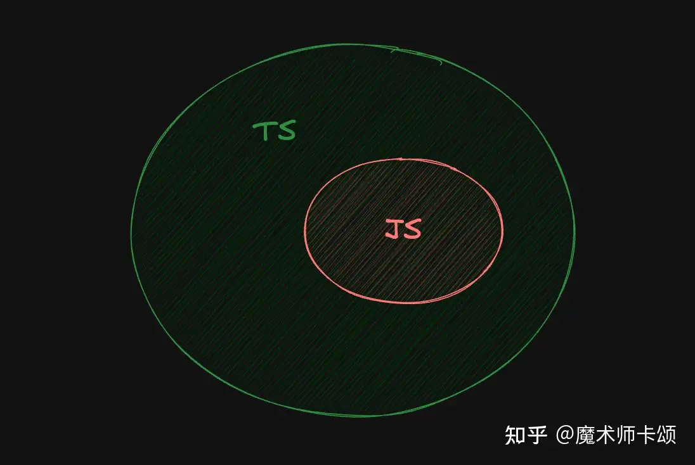
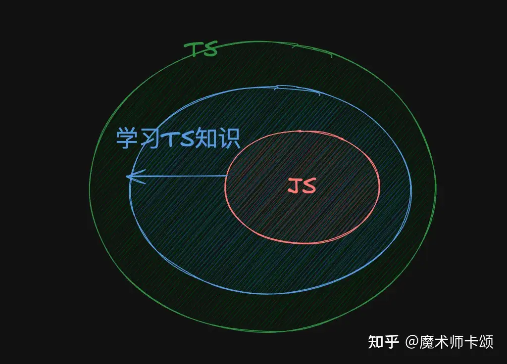

## Typescript是个啥
简而言之，Typescript（Ts）是Javascript（Js）的超集，Ts对Js进行了改良与扩展，所以你可以理解为Ts = Js Pro。

你所写的Ts代码将通过编译器编译为Js文件。

## 它有啥优势
我们说需要编译（先将语言转化为机器语言，再运行）的语言为静态语言，相对的，解释型（先运行，运行到哪里解释器将语言转化为机器语言）语言则是不需要编译的。

上述，可知Ts是编译型语言，而Js则是解释型语言。

所以Ts的优势就随此显现出来：Ts可以再运行程序前揪出所有虫子（Bug）；而Js不可以，它在运行到有错误的代码时才会报错，因此我们可能会忽略很多小虫（而且bug一锅端和重复测试一锅端，哪一个更爽？）。

## 我可以直接跳过Javascript学习Typescript
我先说答案，可以直接上手Ts，但不可能跳过Js。

经常有人建议你先学Js，这是正确的吗？

我们刚才说到，Ts是Js的超集，所以他们的关系如图：

按照部分人的说法，我们的学习路线如下：

这个学习路线其实是没有问题的，如果有了Js基础，那么学习Ts也会感到更容易。

但是我们也要知道，Ts是一门语言，其兼容Js，所以直接学习Ts其实一定会学习Js的，就像图中，学习大圆的内容时接触小圆的内容是无可避免的，反正都会看的先看后看无所谓，看自己选择。（Js的语法糖大部分教程一般不会提及，需要专门看看）
